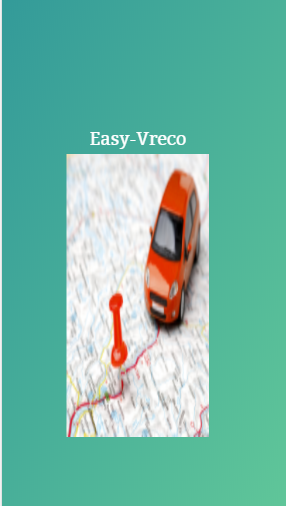
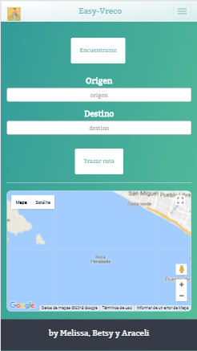
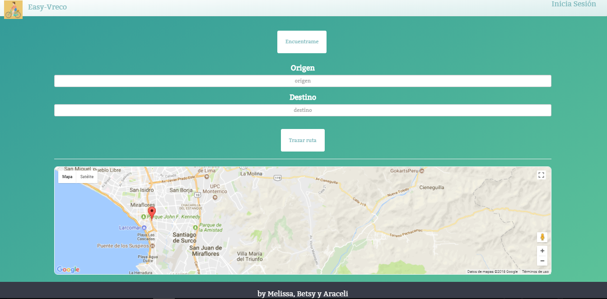
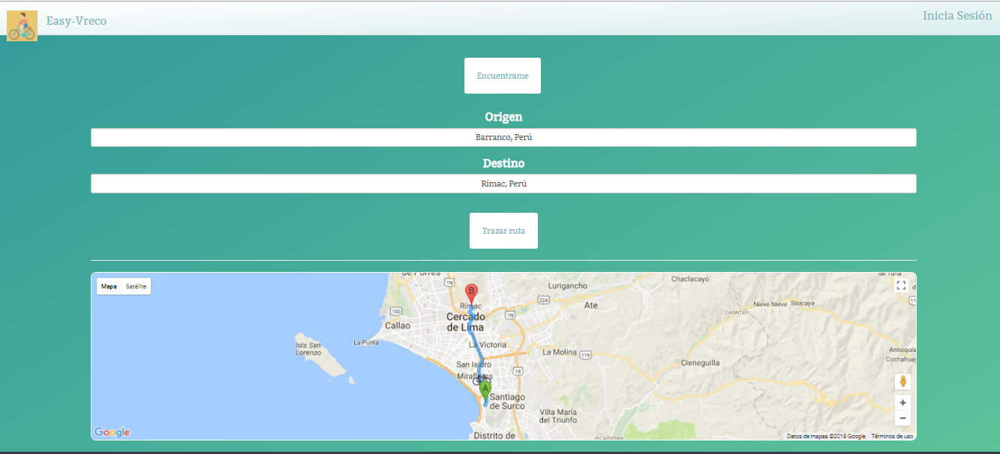

# Easy Vreco

## Objetivo

- El objetivo de esta pagina es trazar rutas, para los ciclistas.

## Flujo de trabajo

- Primero creamos la estructura HTML, en forma anidada.
- Comentar el código.
- Enlazamos el archivo externo del CSS, esto para un mayor orden y hacer uso de las buenas practicas.
- Enlazamos los archivos descargados, para hacer uso de las herramientas de Bootstrap.
- Luego continuamos trabajando en CSS.
- Comentar el código.
- Subimos avances a github.
- Terminar de dar estilo con CSS.
- Empezamos a trabajar con los media queries, para adaptar las vistas a la ventana del navegador.
- Comentar el código.
- Subimos avances a github.
- Cumplimos con el objetivo.
- Digitar el archivo README.md
- Subir el producto final a github.
- Crear la rama "gh-pages".

## Herramientas Utilizadas

- Html, para la estructura del contenido.
- Css, para darle estilo al contenido.
- Bootstrap
- Media queries.

## Fuente consultada

- [Laboratoria LMS] : https://lms.laboratoria.la/cohorts/lim-2017-09-bc-core-pm/courses/social-network/01-css-frameworks/02-bootstrap

- [Bootstrap] : https://getbootstrap.com/docs/3.3/css/#forms

- [W3School] : https://www.w3schools.com/bootstrap/bootstrap_forms.asp

## Imagen
- Vista rápida

- Vista Mobile

-Vista desktop

-Resultado

