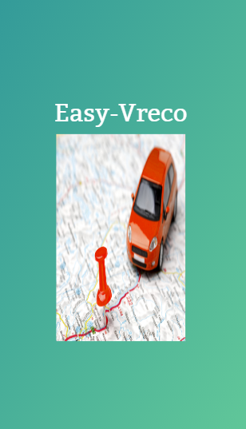
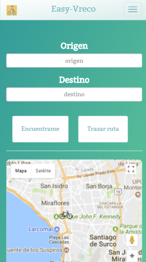
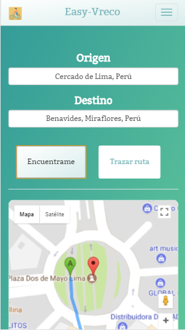
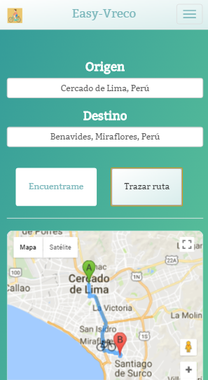
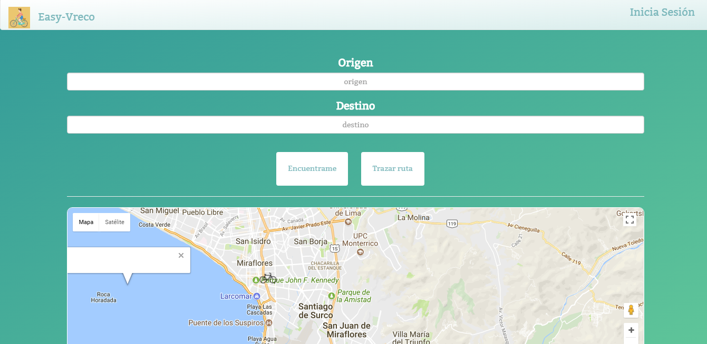

# Easy Vreco

## Objetivo

- El objetivo de esta pagina es, trazar rutas rapidas y seguras para los ciclistas.

## Planificación, Organización y Ejecución

- Miercoles: 07/02/2018
   - Primero nos organizamos y dividimos el trabajo por tareas.
   - Luego cada una subio sus avances a github, previo a esto nos comunicamos por slack para no entrar en conflictos.
   - Para finalizar nos dimos feedback, verificamos el producto final y lo aceptamos. 

## Herramientas Utilizadas

- Html5, para la estructura del contenido.
- API geolocalización, para encontrar al usuario y trazar la ruta.
- Css3, para darle estilo al contenido.
- JS6, para la logica de la página.
- Jquery, para acceder al DOM.
- Bootstrap4
- Media queries.

## Fuente consultada

[Laboratoria LMS](https://lms.laboratoria.la/cohorts/lim-2018-01-bc-js-front-end-developer/courses/spa/01-html-5/08-geolocation-challenges)

[Google Maps Api](https://developers.google.com/maps/documentation/javascript/geolocation)

## Imagen
- Vista Splash

- Vista Mobile

- Location

- Ruta

- Vista Desk

## Integrantes

- Araceli Cueva
- Betsy Vidal
- Melissa Yauri